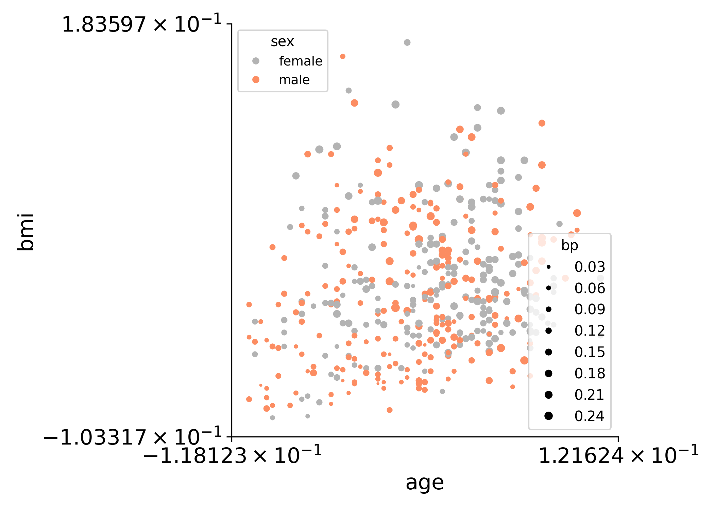
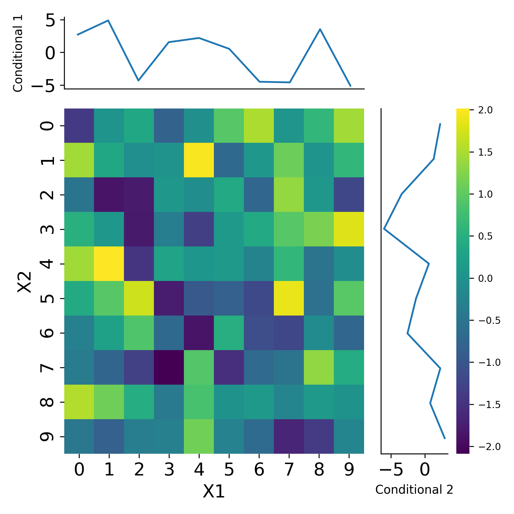
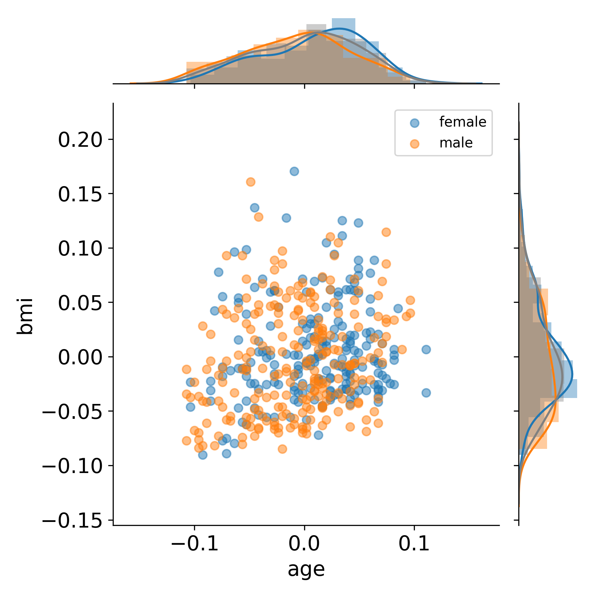
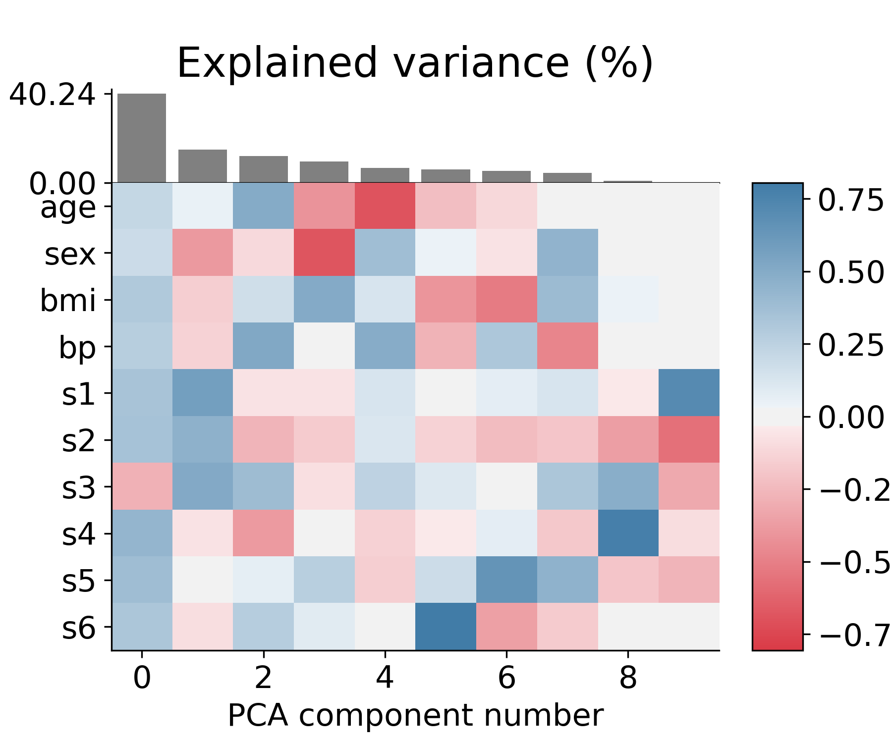
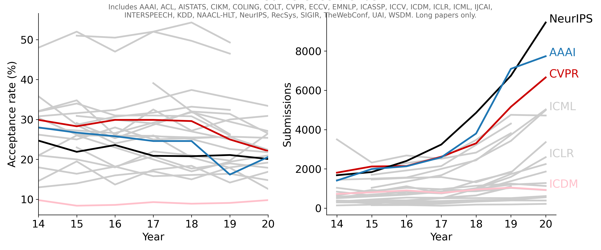

<h1 align="center"> Data-viz utils 📈</h1>

 Functions for data visualization in matplotlib

  
  
  

  

## Plot with 2 legends

## Extended heatmaps

Generating extended heatmaps, trying to replicate some of the behavior of the wonderful R package [superheat](https://github.com/rlbarter/superheat)

- uses seaborn and maplotlib to put together information from multiple plots into one plot
- simple example:

## Grouped jointplot

Based on answer from [here](https://stackoverflow.com/questions/35920885/how-to-overlay-a-seaborn-jointplot-with-a-marginal-distribution-histogram-fr).

## Principal components plot

## AI Conference trends

# Website details
- Theme from [here](https://github.com/inded/Jekyll_modern-blog)
- Based off of this [article from Codrops](http://tympanus.net/codrops/?p=24222)