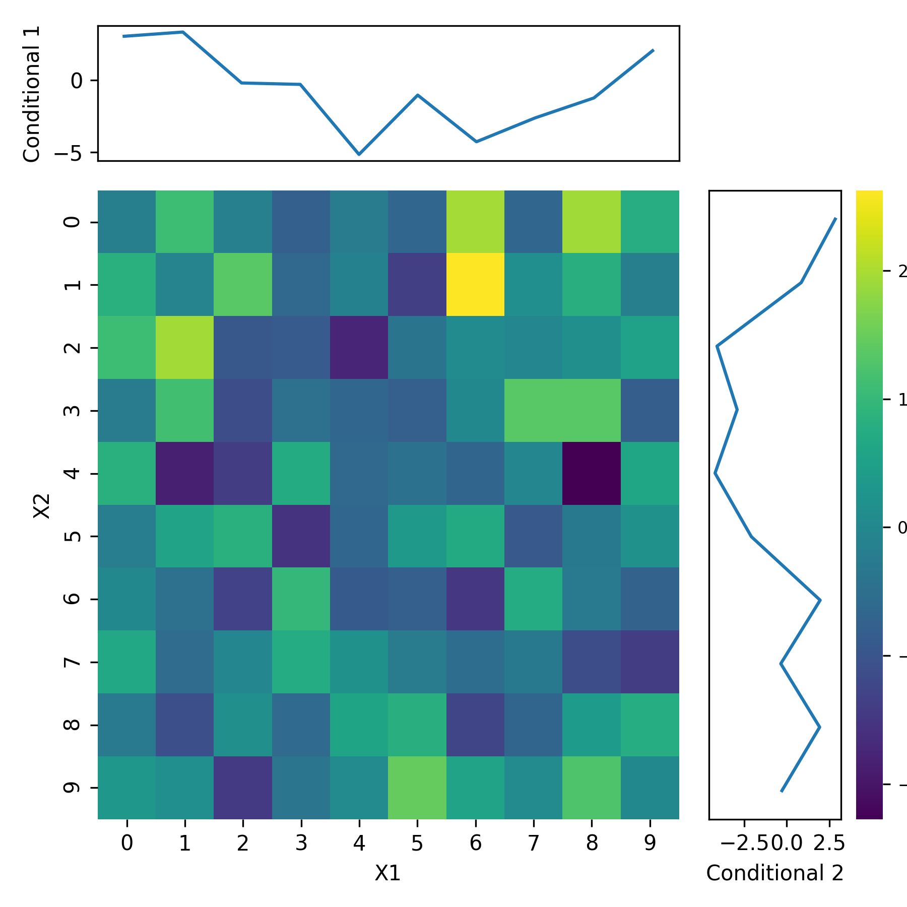
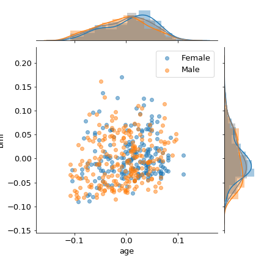
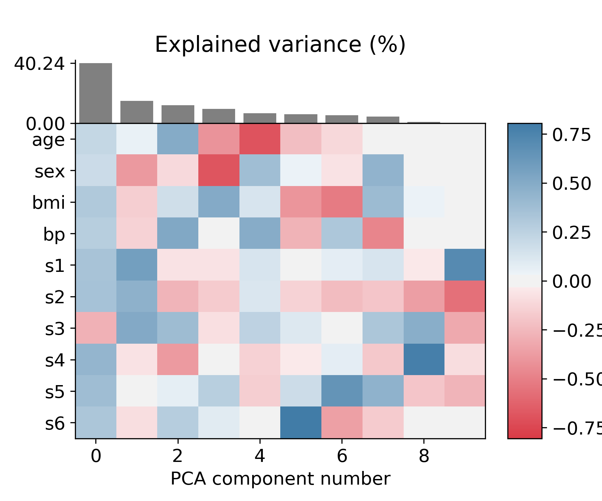

# functions for data visualization in matplotlib

## extended heatmaps

Generating extended heatmaps, trying to replicate some of the behavior of the wonderful R package [superheat](https://github.com/rlbarter/superheat)

- uses seaborn and maplotlib to put together information from multiple plots into one plot
- simple example:

## grouped jointplot

Based on answer from [here](https://stackoverflow.com/questions/35920885/how-to-overlay-a-seaborn-jointplot-with-a-marginal-distribution-histogram-fr).

## pc plot

