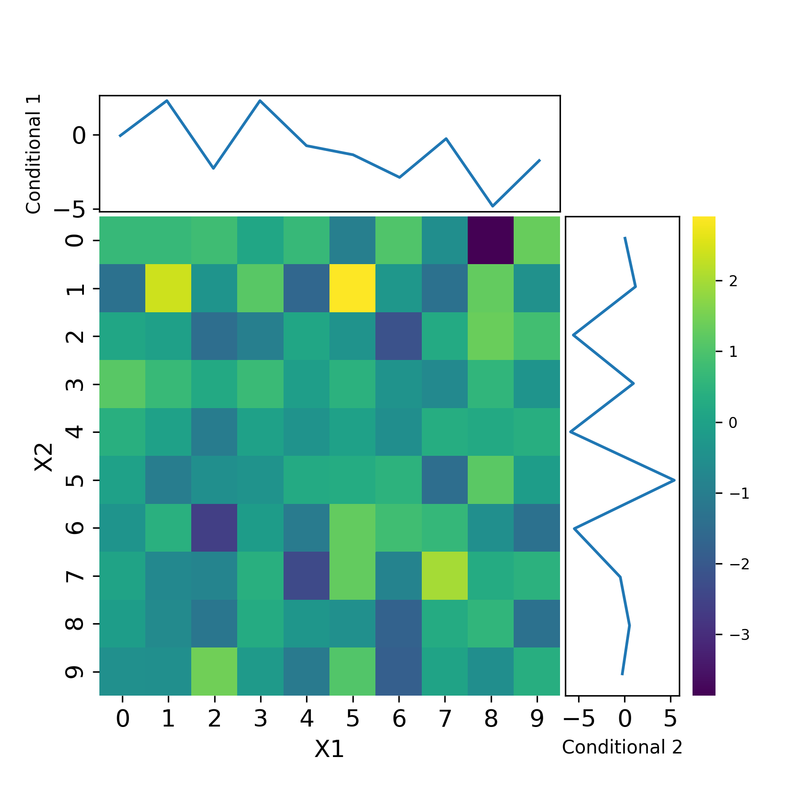

# functions for data visualization in matplotlib

## superheat python

Generating beautiful and customizable heatmaps, trying to replicate some of the behavior of the wonderful R package [superheat](https://github.com/rlbarter/superheat)

- uses seaborn and maplotlib to put together information from multiple plots into one plot
- simple example:

