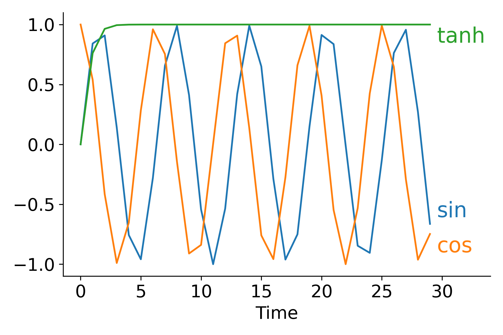

<h1 align="center"> Data-viz utils 📈</h1>

 Functions for data visualization in matplotlib

  
  
  
  

  

<a href="https://csinva.io/data-viz-utils/docs/dvu.html"> 📚 API </a>

Can be installed using `pip install dvu` and them imported with `import dvu`. 

You can also just copy the relatively short source code for the functions (easily viewable [here](https://csinva.io/data-viz-utils/docs/dvu.html)). 

Helps create a bunch of different plots such as these:

One particularly useful function is `dvu.line_legend()` which replaces a typical matplotlib legend with labels for each line:

| Using `plt.legend()`                                | Using `dvu.line_legend()`                      |
| --------------------------------------------------- | ---------------------------------------------- |
|  |  |

Another one is `dvu.invert_plot()` which can be called after generating a plot to invert everything besides the line colors

| Original plot                                  | After `dvu.invert_plot()`                           |
| ---------------------------------------------- | --------------------------------------------------- |
|  |  |

# Reference

- for updates, star the repo or follow [@csinva_](https://twitter.com/csinva_)
- super-related and wonderful [matplotlib-label-lines](https://github.com/cphyc/matplotlib-label-lines) project
- [PR](https://t.co/lTe19vdETE?amp=1) for implementing line-labeling into matplotlib
- feel free to use openly!
- built with jekyll + github pages
- theme from [here](https://github.com/inded/Jekyll_modern-blog)
    - based off of this [article from Codrops](http://tympanus.net/codrops/?p=24222)